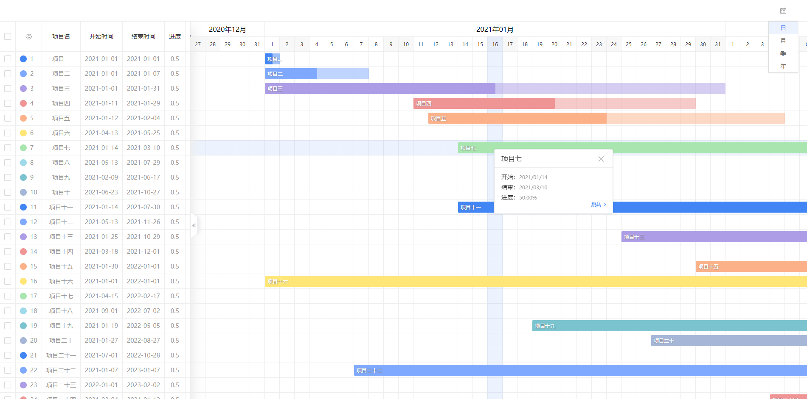
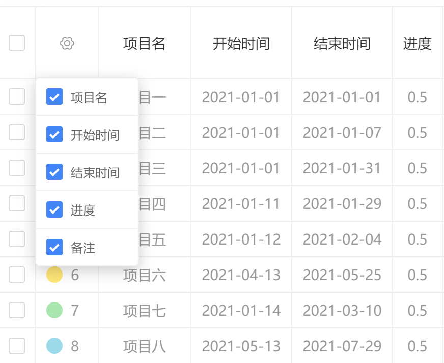

# gantt

* 本甘特图组件为JQ一把梭的结果
* data为数据文件，<b>timeData</b>为渲染表格列的数据，<b>lineContent</b>为渲染表格行，弹出面板，以及任务进度条的数据
* 没[线上地址](http://ernongxizhu.gitee.io/gantt/)是骗不来Star的，你点下试试

* 没图也是骗不过来Star的，预览图如下：

* 抽屉层设置按钮可点击，可过滤抽屉层要显示的项目

* 右上角的按钮可根据时间维度的不同切换甘特图的视图状态

